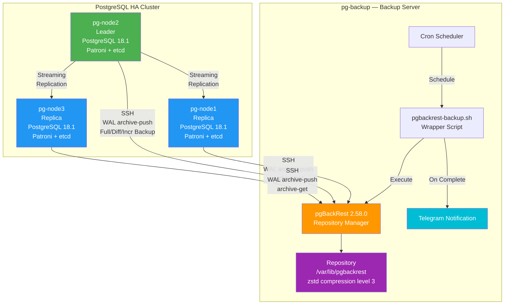
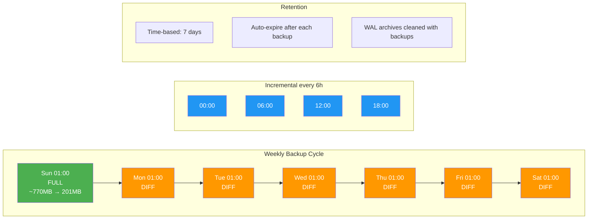
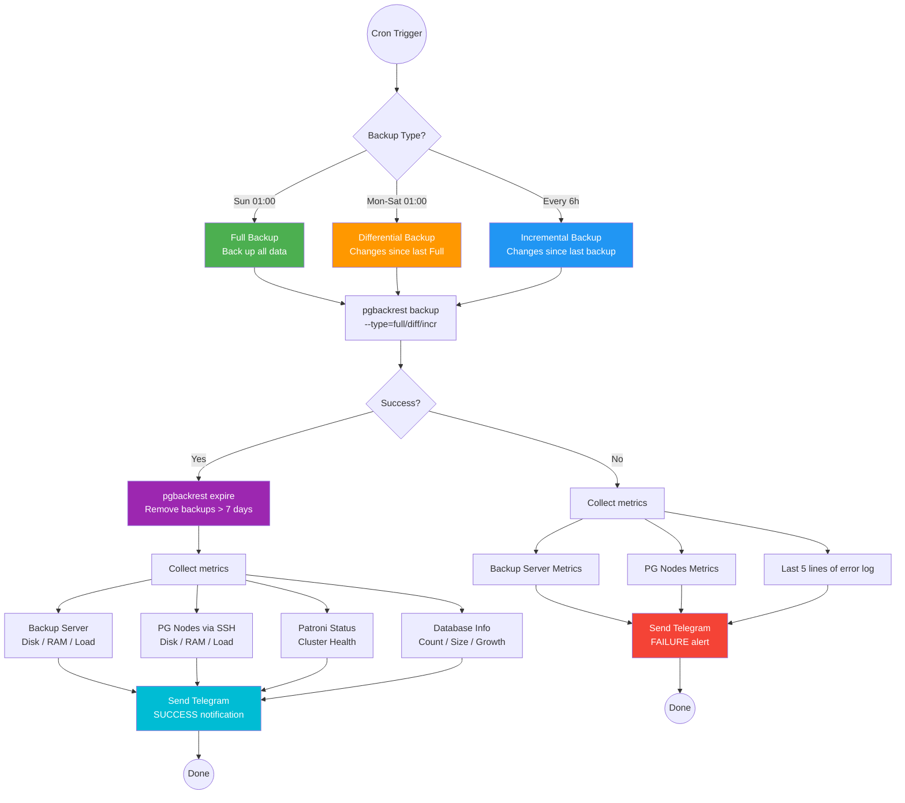
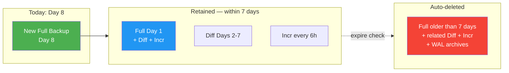
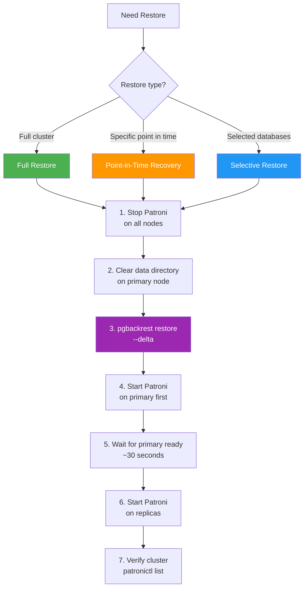

# Backup & Recovery Strategy — PostgreSQL HA Cluster

🇻🇳 [Phiên bản tiếng Việt](BACKUP-vi.md)

## Overview

The system uses **pgBackRest 2.58.0** to back up the entire PostgreSQL 18.1 HA Cluster (3 nodes) to a dedicated backup server via SSH. Supports **Point-in-Time Recovery (PITR)**, continuous **WAL Archiving**, and automatic **Telegram** notifications after each backup.

### Current Specifications (2026-03-21)

| Parameter | Value |
|-----------|-------|
| Database size (raw) | ~770.8 MB (11 databases) |
| Backup size (compressed) | ~201.7 MB (zstd level 3) |
| Compression ratio | ~3.8:1 |
| Retention | **7 days** (time-based) |
| WAL archiving | `archive_mode=on` on all 3 nodes |
| Transport | SSH (`pgbackrest` → `postgres`) |
| Backup server | pg-backup (`$BACKUP_SERVER_IP`) — 4 vCPU / 8 GB RAM |

### Database List

| Database | Size | Description |
|----------|------|-------------|
| btxh_beneficiary | 460 MB | Beneficiaries |
| btxh_report | 163 MB | Reports |
| content_category | 25 MB | Content categories |
| btxh_facility | 18 MB | Social welfare facilities |
| identity | 16 MB | Identity management |
| openapi | 14 MB | API gateway |
| btxh_socialworker | 14 MB | Social workers |
| keycloak | 14 MB | Authentication |
| files | 11 MB | File storage |
| notification | 8 MB | Notifications |
| postgres | 8 MB | System database |
| **Total** | **~751 MB** | **11 databases** |

---

## Backup Architecture



### SSH Flow

```
pgbackrest@pg-backup  ──SSH──►  postgres@pg-node1 (Replica)
                      ──SSH──►  postgres@pg-node2 (Leader)
                      ──SSH──►  postgres@pg-node3 (Replica)
```

- SSH key: Ed25519 (`/home/pgbackrest/.ssh/id_ed25519`)
- Backup server connects **as `postgres` user** on PG nodes
- pgBackRest on PG nodes runs under `postgres` user

---

## Backup Schedule



### Cron Schedule (on pg-backup, user: pgbackrest)

| Type | Cron Expression | Description | Speed |
|------|-----------------|-------------|-------|
| **Full** | `0 1 * * 0` | Sunday 01:00 — Full backup | Slowest (~15s) |
| **Differential** | `0 1 * * 1-6` | Mon-Sat, 01:00 — Changes since last Full | Medium |
| **Incremental** | `0 */6 * * *` | Every 6 hours — Changes since last backup | Fastest |

### Estimated Storage (7-day retention)

| Component | Estimated Size |
|-----------|----------------|
| 1 Full backup (compressed) | ~202 MB |
| 6 Diff backups | ~10-50 MB each (depending on changes) |
| 28 Incr backups (4/day × 7 days) | ~1-10 MB each |
| WAL archives (7 days) | ~200-500 MB |
| **Total estimated repo** | **~1-2 GB** |

---

## Backup Execution Flow



---

## Retention Strategy

### Time-based Retention (7 days)

```ini
# /etc/pgbackrest/pgbackrest.conf
repo1-retention-full-type=time    # Use time instead of count
repo1-retention-full=7            # Keep backups for 7 days
repo1-retention-diff=7            # Keep diffs for 7 days
```

**How it works:**

1. After each successful backup, `pgbackrest expire` runs automatically
2. Removes all Full backups older than 7 days
3. Diff/Incr backups belonging to deleted Fulls are also removed
4. WAL archive files no longer needed are cleaned up

### Retention Flow



---

## Telegram Notification

### Information in Each Notification

Every time a backup runs (success or failure), the system automatically sends a Telegram message with:

**On SUCCESS:**

- Backup type (full/diff/incr), duration, size
- List of all databases + individual sizes
- Database count + total size
- Daily growth rate (compared to previous day)
- Backup server info: disk, repo size, RAM, load
- Each PG node info: disk, RAM, load (warning if disk > 80%)
- Patroni cluster status (leader/replica/streaming lag)

**On FAILURE:**

- Error code and timestamp
- All server metrics
- Last 5 lines of error log

### Telegram Configuration

```bash
# In .env
TELEGRAM_ENABLED=true
TELEGRAM_BOT_TOKEN=<bot_token>    # From @BotFather
TELEGRAM_CHAT_ID=<chat_id>        # Group chat ID
```

---

## pgBackRest Configuration

### Backup Server (`/etc/pgbackrest/pgbackrest.conf`)

```ini
[global]
repo1-path=/var/lib/pgbackrest
repo1-retention-full-type=time
repo1-retention-full=7
repo1-retention-diff=7
compress-type=zst
compress-level=3
process-max=2
log-path=/var/log/pgbackrest
log-level-console=info
log-level-file=detail
spool-path=/var/spool/pgbackrest
start-fast=y
stop-auto=y
delta=y
archive-async=y

[main]
pg1-host=$NODE1_PRIVATE_IP
pg1-host-user=postgres
pg1-path=/var/lib/postgresql/18/data
pg1-port=5432
pg2-host=$NODE2_PRIVATE_IP
pg2-host-user=postgres
pg2-path=/var/lib/postgresql/18/data
pg2-port=5432
pg3-host=$NODE3_PRIVATE_IP
pg3-host-user=postgres
pg3-path=/var/lib/postgresql/18/data
pg3-port=5432
```

### PG Node (`/etc/pgbackrest/pgbackrest.conf`)

```ini
[global]
repo1-host=$BACKUP_SERVER_IP
repo1-host-user=pgbackrest
log-path=/var/log/pgbackrest
log-level-console=info
log-level-file=detail
spool-path=/var/spool/pgbackrest
archive-async=y

[main]
pg1-path=/var/lib/postgresql/18/data
```

### Related `.env` Variables

```bash
PGBACKREST_ENABLED=true
PGBACKREST_STANZA=main
PGBACKREST_REPO_PATH=/var/lib/pgbackrest
PGBACKREST_RETENTION_FULL_TYPE=time
PGBACKREST_RETENTION_FULL=7
PGBACKREST_RETENTION_DIFF=7
PGBACKREST_COMPRESS_TYPE=zst
PGBACKREST_COMPRESS_LEVEL=3
PGBACKREST_PROCESS_MAX=2
PGBACKREST_FULL_SCHEDULE='0 1 * * 0'
PGBACKREST_DIFF_SCHEDULE='0 1 * * 1-6'
PGBACKREST_INCR_SCHEDULE='0 */6 * * *'
```

---

## Manual Operations

### Check Backup Status

```bash
# View backup info
ssh root@$BACKUP_SERVER_IP "sudo -u pgbackrest pgbackrest --stanza=main info"

# View detailed JSON
ssh root@$BACKUP_SERVER_IP "sudo -u pgbackrest pgbackrest --stanza=main info --output=json" | python3 -m json.tool

# Check stanza health
ssh root@$BACKUP_SERVER_IP "sudo -u pgbackrest pgbackrest --stanza=main check"
```

### Run Manual Backup

```bash
# Full backup
ssh root@$BACKUP_SERVER_IP "sudo -u pgbackrest pgbackrest --stanza=main --type=full backup"

# Differential backup
ssh root@$BACKUP_SERVER_IP "sudo -u pgbackrest pgbackrest --stanza=main --type=diff backup"

# Incremental backup
ssh root@$BACKUP_SERVER_IP "sudo -u pgbackrest pgbackrest --stanza=main --type=incr backup"
```

### Expire Old Backups

```bash
ssh root@$BACKUP_SERVER_IP "sudo -u pgbackrest pgbackrest --stanza=main expire"
```

### View Logs

```bash
# Cron job logs
ssh root@$BACKUP_SERVER_IP "tail -50 /var/log/pgbackrest/cron-full.log"
ssh root@$BACKUP_SERVER_IP "tail -50 /var/log/pgbackrest/cron-diff.log"

# pgBackRest detail logs
ssh root@$BACKUP_SERVER_IP "ls -la /var/log/pgbackrest/"
```

---

## Restore & Recovery

### Restore Flow



### Full Cluster Restore

```bash
# 1. Stop Patroni on all nodes
ssh root@$NODE1_PRIVATE_IP "systemctl stop patroni"
ssh root@$NODE2_PRIVATE_IP "systemctl stop patroni"
ssh root@$NODE3_PRIVATE_IP "systemctl stop patroni"

# 2. Clear old data on primary
ssh root@$NODE1_PRIVATE_IP "rm -rf /var/lib/postgresql/18/data/*"

# 3. Restore from latest backup
ssh root@$NODE1_PRIVATE_IP "sudo -u postgres pgbackrest --stanza=main --delta restore"

# 4. Start primary first
ssh root@$NODE1_PRIVATE_IP "systemctl start patroni"

# 5. Wait for primary to be ready, start replicas
sleep 30
ssh root@$NODE2_PRIVATE_IP "systemctl start patroni"
ssh root@$NODE3_PRIVATE_IP "systemctl start patroni"

# 6. Verify cluster
ssh root@$NODE1_PRIVATE_IP "patronictl -c /etc/patroni/patroni.yml list"
```

### Point-in-Time Recovery (PITR)

```bash
# Restore to a specific point in time
ssh root@$NODE1_PRIVATE_IP "sudo -u postgres pgbackrest --stanza=main \
  --type=time \"--target=2026-03-21 14:30:00+07\" \
  --target-action=promote \
  --delta restore"
```

### Selective Restore (specific databases)

```bash
# Restore only identity and keycloak databases
ssh root@$NODE1_PRIVATE_IP "sudo -u postgres pgbackrest --stanza=main \
  --db-include=identity --db-include=keycloak \
  --delta restore"
```

---

## Deployment

### First-time Deployment

```bash
# Load environment
set -a && source .env && set +a

# Deploy entire backup infrastructure
ansible-playbook playbooks/deploy-backup.yml -i inventory/hosts.yml
```

The playbook executes 4 phases:

1. **Common setup**: install packages, hostname, firewall, chrony on backup server
2. **pgBackRest install**: SSH keys, config, stanza creation on backup + PG nodes
3. **Patroni reload**: enable `archive_mode=on` and `archive_command` via DCS
4. **Initial full backup**: run first backup + send Telegram notification

### File Structure

```
roles/pgbackrest/
├── defaults/main.yml                    # Default variables
├── handlers/main.yml                    # Handlers
├── tasks/main.yml                       # Install, SSH, config, stanza, cron
└── templates/
    ├── pgbackrest-repo.conf.j2          # Backup server config
    ├── pgbackrest-pg.conf.j2            # PG node config
    └── pgbackrest-backup.sh.j2          # Cron backup script + Telegram
```

---

## Troubleshooting

### Check WAL Archiving

```bash
# Archive status on PG node
ssh root@$NODE1_PRIVATE_IP "sudo -u postgres psql -c 'SELECT * FROM pg_stat_archiver;'"

# Check archive_mode
ssh root@$NODE1_PRIVATE_IP "sudo -u postgres psql -c 'SHOW archive_mode;'"
```

### Backup Failure

```bash
# View detailed log
ssh root@$BACKUP_SERVER_IP "tail -100 /var/log/pgbackrest/cron-full.log"

# Check SSH connectivity
ssh root@$BACKUP_SERVER_IP "sudo -u pgbackrest ssh postgres@$NODE1_PRIVATE_IP hostname"

# Check stanza
ssh root@$BACKUP_SERVER_IP "sudo -u pgbackrest pgbackrest --stanza=main check"
```

### Rapid Database Growth

```bash
# View growth history
ssh root@$BACKUP_SERVER_IP "cat /var/log/pgbackrest/db_size_history.log"

# View repo size
ssh root@$BACKUP_SERVER_IP "du -sh /var/lib/pgbackrest/"

# If repo is too large, run manual expire
ssh root@$BACKUP_SERVER_IP "sudo -u pgbackrest pgbackrest --stanza=main expire"
```
